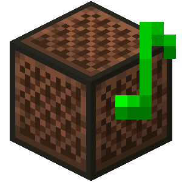

<section id="banner">
	
	<h2>Open Note Block Studio</h2>
	
一个开源的音符盒编辑器

	<ul class="actions vertical">
		<li><a href="https://github.com/HielkeMinecraft/OpenNoteBlockStudio/releases/latest/download/Minecraft.Note.Block.Studio.exe" class="button special icon fa-download big" id="downloadBtn">下载</a></li>
		<li><a href="{{'/changelog' | absolute_url}}" class="button">更新日志</a></li>
	</ul>
</section>
<section id="one" class="wrapper style2 special">
	

		

			

				<i class="fa fa-bug" style="font-size:40px"></i>
				<h2>Report bugs</h2>
				
当你发现了bug,请通过issues页面上交.
					这是反馈问题的方式! 
					<strong>Note:</strong> 请提问前仔细确认这是一个bug!

					<ul class="actions vertical">
						<li><a href="https://github.com/HielkeMinecraft/OpenNoteBlockStudio/issues" class="button">反馈问题</a></li>
					</ul>
					 	
				

				

					<i class="fa fa-comments" style="font-size:40px"></i>
					<h2>保持联系</h2>
					
通过加入我们的官方Discord服务器来获取支持. 这是联系我们的最快方式!

					<ul class="actions vertical">
						<li><a href="https://discord.gg/w35BqQp" class="button">加入服务器</a></li>
					</ul>
					 
				

				

					<i class="fa fa-users" style="font-size:40px"></i>
					<h2>构建</h2>
					
本项目使用Game Maker Language (GML)编写.
						 
					你必须使用 GameMaker Studio 2才能打开项目与做出改变.

					<ul class="actions vertical">
						<li><a href="https://github.com/HielkeMinecraft/OpenNoteBlockStudio/pulls" class="button">构建!</a></li>
					</ul>
					 
				

			

		

		
	</section>
	